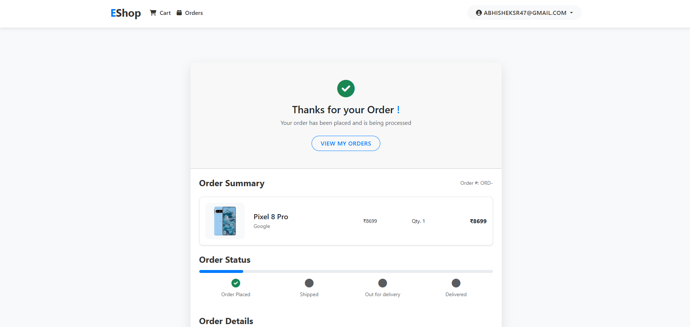

# eShop

Welcome to eShop, an advanced e-commerce platform built using the MERN stack (MongoDB, Express.js, React, Node.js). This project demonstrates the use of modern web development technologies to create a full-fledged, responsive, and scalable online shopping experience.

## Features

- **User Authentication & Authorization**: Secure login and registration using bcrypt.
- **Product Management**: Admin can add, edit, and delete products.
- **Shopping Cart**: Add products to the cart, adjust quantities, and remove items.
- **Order Management**: Users can place orders, view order history, and track order status.
- **Payment Integration**: Secure payment processing using Stripe.
- **Responsive Design**: Mobile-first approach with responsive layout.
- **Product Search & Filtering**: Dynamic search and category filtering.

### Home Page


### Item Menu


### Login


### Cart


### Orders


### Summary and Shipping Details


### Payment Gateway


### Succesfull Order



## Technologies Used

### Frontend

- **Bootstrap**: CSS framework for responsive and mobile-first web development.
- **Handlebars (hbs)**: Templating engine for building dynamic HTML pages.
- **AJAX**: For asynchronous web requests to update the frontend without reloading the page.
- **Axios**: For making HTTP requests to the backend API.

### Backend

- **Node.js**: JavaScript runtime built on Chrome's V8 engine.
- **Express.js**: Fast, unopinionated, minimalist web framework for Node.js.
- **MongoDB**: NoSQL database for storing product, user, and order data.

## Installation

To set up the project locally, follow these steps:

1. **Clone the repository**:
   ```bash
   git clone https://github.com/abhishek123-asr/eshop.git
   cd eshop

2. **Install dependencies**:
   ```bash
   npm install
3. **Start the server**:
   ```bash
   npm start
